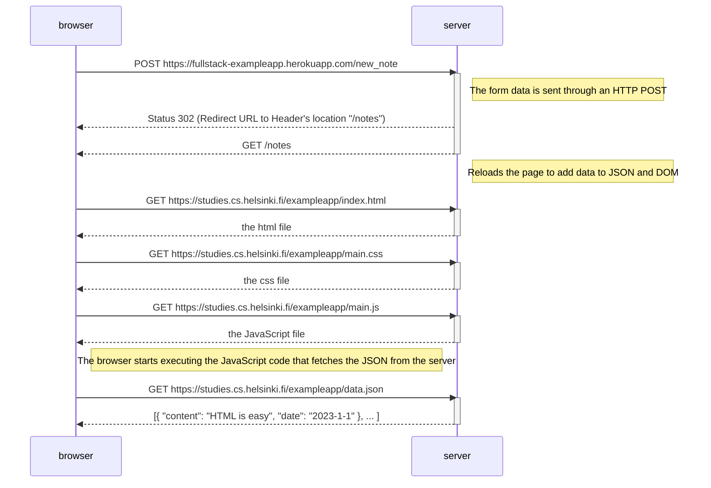

# Sequence diagram of when user creates a note on the page

```mermaid
sequenceDiagram
    participant browser
    participant server

    browser->>server: POST https://fullstack-exampleapp.herokuapp.com/new_note
    activate server

    Note right of server: The form data is sent through an HTTP POST

    server-->>browser: Status 302 (Redirect URL to Header's location "/notes")
    server-->>browser: GET /notes
    deactivate server

    Note right of server: Reloads the page to add data to JSON and DOM

    browser->>server: GET https://studies.cs.helsinki.fi/exampleapp/index.html
    activate server
    server-->>browser: the html file
    deactivate server

    browser->>server: GET https://studies.cs.helsinki.fi/exampleapp/main.css
    activate server
    server-->>browser: the css file
    deactivate server

    browser->>server: GET https://studies.cs.helsinki.fi/exampleapp/main.js
    activate server
    server-->>browser: the JavaScript file
    deactivate server

    Note right of browser: The browser starts executing the JavaScript code that fetches the JSON from the server

    browser->>server: GET https://studies.cs.helsinki.fi/exampleapp/data.json
    activate server
    server-->>browser: [{ "content": "HTML is easy", "date": "2023-1-1" }, ... ]
    deactivate server

```
