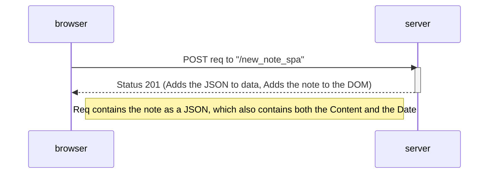

# Single Page Application Diagram

```mermaid
sequenceDiagram
    participant browser
    participant server

    browser->>server: POST req to "/new_note_spa"
    activate server
    server-->>browser: Status 201 (Adds the JSON to data, Adds the note to the DOM)
    deactivate server

    Note right of browser: Req contains the note as a JSON, which also contains both the Content and the Date
```
